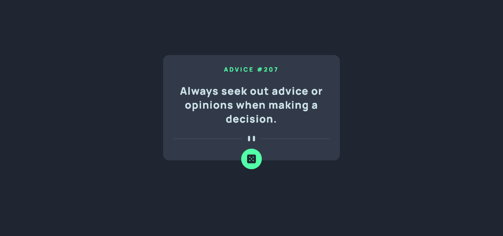

# Frontend Mentor - Advice generator app solution

This is a solution to the [Advice generator app challenge on Frontend Mentor](https://www.frontendmentor.io/challenges/advice-generator-app-QdUG-13db).

## Table of contents

- [The challenge](#the-challenge)
- [Screenshot](#screenshot)
- [Built with](#built-with)

## The challenge

Users should be able to:

- View the optimal layout for the app depending on their device's screen size
- See hover states for all interactive elements on the page
- Generate a new piece of advice by clicking the dice icon

## Screenshot

## Built with

- HTML, CSS, JS
- [React](https://reactjs.org/)
- Flexbox, JSX, [Advice Slip API](https://api.adviceslip.com/)
